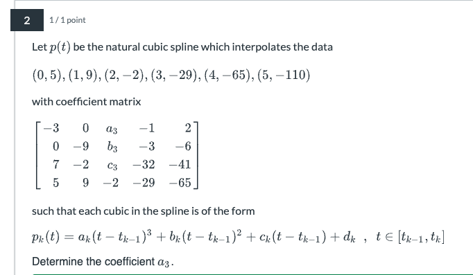
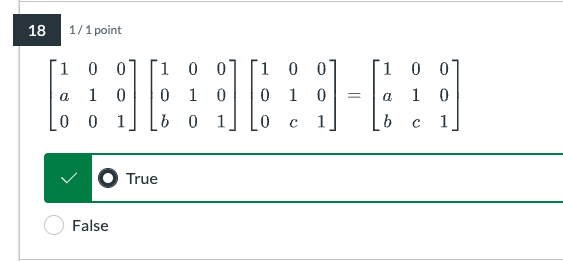
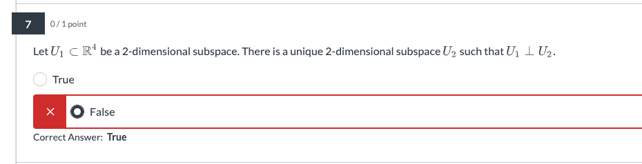
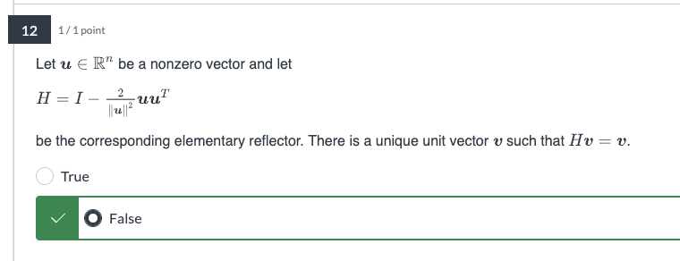
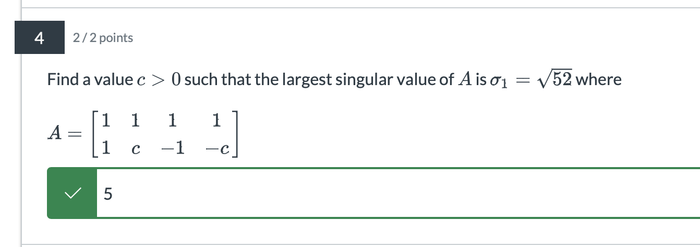
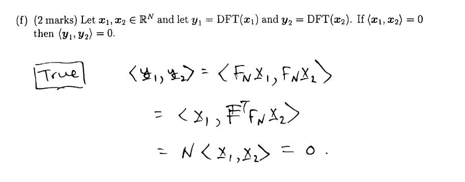

# Quiz 1

- question 1

    

  - note that we don't actually need to solve for $a_3, b_3, c_3$ here (that comes later)

  - as $1.5 \in [1, 2]$, we'll use $p_2(t)$ 
    $$
    \begin{align*}
    p_2(t) &= a_2(t-t_{1})^3 + a_2(t-t_{1})^2 + c_2 (t-t_{1}) + d_2 \\ 
    p_2'(t) &=3a_2(t - t_{1})^2 + 2a_2(t-t_{1}) + c_2 \\
    &= 3(0)(t - t_{1})^2 + 2(-9)(t-t_{1}) -2  \\
    p_2'(1.5) &= -18(1.5-1) - 2 \\ 
    &= -11
    \end{align*}
    $$

- question 2

   

  - now we have to solve 

  - first we'll define the right side and the left side ($p_k(t_k)$ and $p_{k+1}(t_k)$, respectively) of the 2 endpoints as well as their first and second derivative 
    $$
    \begin{align*}
    p_k(t) &= a_k(t - t_{k-1})^3 +b_k(t- t_{k-1})^2 + c_k(t-t_{k-1}) + d_k \\
    p_k(t_k) &= a_k(t_k - t_{k-1})^3 +b_k(t_k- t_{k-1})^2 + c_k(t_k -t_{k-1}) + d_k \\
    &= a_k + b_k + c_k + d_k ~~~~~~~~~~~ \text{because } t_k - t_{k-1} =1\text{ for all data points} \\\\
    p_{k+1}(t) &= a_{k+1}(t-t_k)^3 + b_{k+1}(t - t_k)^2 + c_{k+1}(t - t_k) + d_{k+1} \\ 
    p_{k+1}(t_k) &= a_{k+1}(t_k-t_k)^3 + b_{k+1}(t_k - t_k)^2 + c_{k+1}(t_k - t_k) + d_{k+1} \\ 
    &= d_{k+1} ~~~~~~~~~~\text{because } t_k - t_k = 0 \\\\
    
    \text{and, } ~{p_k}^\prime(t) &= 3a_k(t-t_{k-1}) + 2b_k(t-t_{k-1}) +c_k \\ 
    {p_k}^\prime(t_k) &=  3a_k + 2b_k + c_k \\
    \\
    {p_{k+1}}^\prime(t) &= 3a_{k+1}(t - t_k) + 2b_{k+1}(t - t_k) + c_{k+1} \\
    {p_{k+1}}^\prime(t_k) &= c_{k+1} \\
    \\
    {p_k}^{\prime\prime}(t_k) &= 6a_k + 2b_k \\
    {p_{k+1}}^{\prime\prime}(t_{k}) &= 2b_{k+1}
    \end{align*}
    $$

  - then we can set up 3 different equations (we only need 3 out of the possible equations we can set up)

    - make the endpoints equal 
      $$
      \begin{align} 
      p_k(t_k) &= p_{k+1} (t_k)  &&\text{make endpoints equal} \\
      {p_k}^\prime(t_k) &= {p_{k+1}}^\prime(t_k)  &&\text{first derivative continuity}\\ 
      {p_k}^{\prime\prime}(t_k) &= {p_{k+1}}^{\prime\prime}(t_k) &&\text{second derivative continuity}\\  
      \end{align}
      $$

    - eq 3) turns out to be the simplest to solve first
      $$
      \begin{align*}
      {p_k}^{\prime\prime}(t_k) &= {p_{k+1}}^{\prime\prime}(t_k)
      \\
      {p_2}^{\prime\prime}(t_k) &= {p_{3}}^{\prime\prime}(t_k) \\
      6a_3 + 2b_3 &= 2b_3 \\
      0 - 18 &= 2b_3\\
      b_3 &= -9
      \end{align*}
      $$

    - from there, we can solve eq 2)
      $$
      \begin{align*}
      {p_k}^\prime(t_k) &= {p_{k+1}}^\prime(t_k) \\
      {p_2}^\prime(t_k) &= {p_{3}}^\prime(t_k) \\ 
      3a_2 + 2b_3 + c_2 &= c_3 \\ 
      c_3 &= 3(0 ) + 2(-9) -2 \\
      &= -20 
      \end{align*}
      $$

    - then we'll solve eq 1)
      $$
      \begin{align*}
      p_k(t_k) &= p_{k+1} (t_k)\\
      p_3(t_k) &= p_{4} (t_k) \\ 
      6a_3 + 2b_3 &= 2b_4 \\
      6a_3 + 2(-9) &= 2(-3) \\
      a_3 &= 2
      \end{align*}
      $$

      - note that we can choose what ever $k$ and $k+1$​ that makes in convenient for us

  - so we have 
    $$
    \begin{bmatrix}
    a_3 \\ b_3 \\ c_3
    \end{bmatrix} 
     = 
     \begin{bmatrix}
    2 \\ -9 \\ -20
    \end{bmatrix}
    $$

- question 3

  

  - we know that the Vandermonde matrix (for polynomial interpolation) is very big and the system is very unstable as $d$ increases
  - contrasting this, we also know that the cubic spline interpolant is less unstable 
  - thus, we'd expect $\text{cond}(A_1) > \text{cond}(A_2)$​
  - so the answer is false

- question 4

   

  - question: something about $d-1$ polynomial? but does "at most $d$" does not imply it can have $0\times t^d$ or something like that 
  - however, we still have to solve for the $c_d$ coefficients, and so we have more variables than equations, so $c_d$ is free, and so there's no unique solution

- question 5

   

  - extra condition so need more points?
  - note: from the prof - the question should have said that there is ALWAYS a unique polynomia
  - in that case that's not true because we have more equations than unknowns, so that doesn't always have a solution (depends on the $y$'s - see Q8)

- question 6

   

  - here we have more columns than rows, meaning we have more variables than equations 
  - despite having $m$ rank, this is still not enough to solve for $n$ variables, thus there are free variables

- question 7

   

  - because we have less pivots than variables - it's always free 
    - this is true

- question 8

   

  - because it depends on $b$ to be consistent?

  - yes, so we can have $r_2 = r_3$ and so we have 
    $$
    \begin{align*}
    X = \begin{bmatrix}
    r_1 \\ r_2 \\ r_3
    
    \end{bmatrix} &= \begin{bmatrix}
    b_1 \\ b_2 \\b_3 
    \end{bmatrix} \\
    
    \begin{bmatrix}
    r_1 \\ r_2 \\ 0 
    \end{bmatrix}
    &= \begin{bmatrix}
    b_1 \\ b_2 \\
    b_3 - b_2
    \end{bmatrix}
    \end{align*}
    $$
    
  - so for this to work, we need $b_3 = b_2$ as well 

- question 9

   

  - from class, we can find the maximum and min stretch (using the diagram)

     

    (this is just using basic trig)

  - calculating the condition number 

     

- question 10

   

  - just make into augmented matrix and solve 

- question 11

   

  - we have 
    $$
    \begin{align*}
    A &= 4R = 4\begin{bmatrix} 
    \cos(\pi/4) & \sin(\pi/4) \\ 
    -\sin(\pi/4) & \cos(\pi/4)
    \end{bmatrix}
    \end{align*}
    $$

  - we know that $\norm{A}$ (operator norm) is the maximum stretch of A, but in this case, the rotation matrix itself does not stretch, so we have
    $$
    \begin{align*}
    \norm{R} &= 1 \\
    \therefore \norm{A} &= 4
    \end{align*}
    $$

    - which makes sense, since $A$ rotates then stretches it to 4 (imagine a circle becoming a larger circle)

  - we can also note that the min stretch of $A$ is also 4 (it's still a circle - radius is now 4)

  - thus we have
    $$
    \norm{A^{-1}} = \dfrac{1}{\text{min stretch of } A} = \dfrac 1 4
    $$

- question 12

   

  - as we saw above, for these kind of rotation-then-scale matrix, the min and max stretch is the same and it is the scaling factor
    $$
    \begin{align*}
    \text{min stretch} &= \text{max stretch} = 5 \\
    \text{cond}(A) &= \dfrac{\text{max stretch}}{\text{min stretch}} = \dfrac5 5 = 1
    \end{align*}
    $$

- question 13

   

  - set up augemnted matrix between $L$ and $b$ (so $[L \mid b]$) and solve

- question 14

   

  - you can track operations using the $L$ matrix 
  - see this video for an example: https://www.youtube.com/watch?v=BFYFkn-eOQk

- question 15

   

  - polynomial of degree 2 looks like
    $$
    p(t) = c_0 + c_1 t + c_2t^2
    $$

  - so we have
    $$
    \begin{align*}
    p(t) &= c_0 + c_1 t + c_2t^2 \\
    p(0) &= c_0 = 0 \\
    p(2) &= c_0 + 2c_1 + 4c_2  = 0\\
    \\
    p'(t) &= c_1 + 2c_2t \\
    p'(1) &= c_1 + 2c_2 = 0 \\ \\
    
    
    \end{align*}
    $$

  - all of the formulas put together
    $$
    \begin{align*}
    c_0 &= 0 \\
    c_0 + 2c_1 + 4c_2 &= 0\\
    c_1 + 2c_2 &= 0\\ \\
    2c_1 + 4c_2  &=0 \\
    &=2(c_1 + 2c_2)
    \end{align*}
    $$

  - so we see that 2 of the equations are linearly dependent, thus we have 2 equations, 3 variables &rightarrow; infinitely many solutions

- question 16

   

  - same thing as above, we can say
    $$
    \begin{align*}
    p(t) &= c_0 + c_1 t+c_2t^2 + c_3 t^3 \\ 
    p(0) &= c_0 = 1\\
    \\
    p'(t) &= c_1 + 2c_2t + 2c_3t^2 \\
    p'(0) &= c_1 = 1 \\
    \\
    p''(t) &= 2c_2 + 4c_3t \\
    p''(0) &= 2c_2 = 1
    
    \end{align*}
    $$

  - since we have no constraints on $c_3$, it can be anything we want and still satisfy the requirements above, so there are <u>infinite solutions</u> - thus this is false

- question 17

   

  - same thing as above, just add an extra step
    $$
    \begin{align*}
    p'''(t) &= 4c_3 = 1\\
    c_3 &= 1/4
    \end{align*}
    $$

  - so now we have a constraint on $c_3$, thus there is a unique solution

- question 18

   

  - this works because this is how the LU decomposition trick used

- question 19

   

  - matrix multiplication is not communicative like that 

- question 20

   

  - just do the math

  - the answer is 

     

- question 21

   

  - for triangular matrices, the determinant is the product of the diagonals

  - and for matrix multiplication, you can multiply the determinant
    $$
    \begin{align*}
    \det(A \times B) &= \det(A) \times \det(B) \\
    &= (1 \times 1 \times 1 \times 1) \times (1  \times -2 \times 5 \times -1)\\
    &= 10
    \end{align*}
    $$

- question 22

   

  - by definition
    $$
    \begin{align*}
    \text{cond}(A) &= \norm{A} \times \norm{A^{-1}} \\
    \text{cond}(A^{-1}) &= \norm{A^{-1}} \times \norm{(A^{-1})^{-1}} \\
    &= \norm{A^{-1}} \times \norm{A}
    \end{align*}
    $$

  - note that the multiplication above is between 2 scalars thus they are communicative

- question 23

   

  - we can do the math
    $$
    \begin{align*}
    b + \Delta b  &= \begin{bmatrix}-1 \\ 1 \\ 3 \\ -1 \end{bmatrix} 
    \longrightarrow \Delta b = \begin{bmatrix}1 \\ -1 \\ 1 \\ 1 \end{bmatrix} \\
    \norm{\Delta b} &= \sqrt{4} = 2 \\
    \norm{b} &= \sqrt{16} = 4\\
    \norm{x} &= \sqrt{4} = 2\\
    \\
    \dfrac{\norm{\Delta x}}{\norm {x}} &\leq \text{cond}(A) \times \dfrac{\norm{\Delta b}}{\norm{b}}\\
    \norm{\Delta x} &\leq  16 \times \dfrac{2}{4} \times 2 \\
    &\leq 16
    \end{align*}
    $$
    

# Practice questions

## Subspaces

- https://ubcmath.github.io/MATH307/orthogonality/subspaces.html

- question 

   

  - why did we prove for linearly independence here
  - check my work - is that correct

- question 

   

  - I was able to get that $\{u_1, u_2, u_3\}$ was the basis and so dimension is 3
  - I had to basically do it again to get $\{u_1, u_3, u_4\}$​ also formed a basis - is this correct or do I have to check again?

## Midterms

- 2021W1 Midterm Practice

  - this was hard AF, were we supposed to do this in 45 minutes
  - 4b) why can we continue from the REF from part A, the column ordering is different
    - double check: if you know that $\text{dim}(U) = 3$, then that means that any 3 linearly independent vector $v_i \in U$ will form a basis for U?

- 2021W1 Midterm 1A

  - ==1b==: I have no idea what this is

     

    - TODID: you can approach this from the geometric approach too
    - since $\norm{Ax} = \text{size of $x$ after applied by $A$} \leq \norm{x}$ for all $x$, this means that $A$ does not stretch a matrix, but rather shrinks or maintain it
    - this means that the $\text{min stretch} \leq \text{max stretch} \leq 1$
    - and so when we have $1 / \text{min stretch} \geq 1$ when

  - ==4==: double check why linear independence mean that their span is not equal

    - head canon: I think that because $\{u_1, u_2, u_4\}$ is linearly independent, that means that $a u_1 + bu_2 \neq u_4 ~\forall ~ a,b \in \R$, thus $u_4 \not\in \text{span}\{u_1, u_2\}$ and so their span cannot equal?

- 2021W1 Midterm 1B

  - 1a) would a counter example work?

     

  - 1b) so it's not that the number of equations that really matter, it's the number of linearly independent equations that matter?

     

  - ==1c==: does performing row operations change the condition number? I first tried to row reduce and try to find a recursive equation for $u_{n,n}$​ and then find the max of that 

     

    - also, why is it when $c$​ is large we can make this approximation?
    - TODID
      - <u>row operation does change the condition numbers</u>
      - you can make this approximation because the scaling factor of $c$ has much bigger influence than the scaling factor of the $1$'s especially when $c$ is large

- 2021S Midterm 

  - ==1a== I literally have no idea what the solution is saying

     

    - TODID

      - was a bit harder but we can find a counter example

      - we first pick $A$
        $$
        A = \begin{bmatrix}
        0 &1 &0 \\
        0 &0 &1 \\
        0 &0 &0
        \end{bmatrix}
        $$
        this basically shifts the vector values up and make the last element 0

        - i.e $[x_1, x_2, x_3] \longrightarrow [x_2, x_3, 0] \longrightarrow [x_3, 0, 0]$

      - and do $A^3$ just means we apply $A$ 3 times, let's pick $u = [0, 0, 1]$
        $$
        \begin{align*}
        &u = \begin{bmatrix} 
        0 \\ 0 \\ 1
        \end{bmatrix}
        &&Au = \begin{bmatrix} 
         0 \\ 1 \\0 
        \end{bmatrix}
        &&A(Au) = \begin{bmatrix} 
        1 \\0 \\ 0
        \end{bmatrix}
        &&A(AAu) = \begin{bmatrix} 
        0 \\ 0 \\ 0
        \end{bmatrix}
        \end{align*}
        $$

      - from here we can see that $Au \in R(A)$ but $Au \not \in N(A) $ because $A(A(u)) \neq 0$ 

      - (so $Au$ is actually the chosen vector here) 

  - ==1d== I also don't get this one

     

    - I get the rank and span stuff (first 2 lines)

    - important: the $L$ matrix is exactly the same across the 2 decomposition 
      
    - say $\rank(A_1) = 3$ and $\rank(A_2) = 4$, we'll have
      $$
      \begin{align*}
      R(A_1) &= \text{span}\{l_1, l_2, l_3\}\\
      R(A_2) &= \text{span}\{l_1, l_2, l_3, l_4\}
      \end{align*}
      $$
      
      - and so quite literally we can see $R(A_1) \subseteq R(A_4)$

  - 4b) same as above, why can we continue from the REF with different column set up

  - 4d) do we have to check for linearly independence, or is the fact that the rank is 4 enough?

  - ==7== no idea what's going on here

     

     

    - TODID

      - we need to notice that it's a Vandemonde matrix (given in the hint) &rightarrow; remember that Vandemonde matrix is associated with polynomial interpolation, more specifically 
        $$
        \begin{align*}
                \begin{bmatrix*}
                    1 & t_0 & (t_0)^2 &\ldots &(t_0)^d \\ 
                    &\ddots  \\ 
                    & &\ddots \\ 
                    &&& \ddots \\
                    (t_d)^0 & (t_d)^1 & (t_d)^2 & \ldots & (t_d)^d
                \end{bmatrix*}
                \begin{bmatrix*}
                    c_0 \\ c_1 \\ c_2 \\ \vdots \\ c_d
                \end{bmatrix*} = 
                \begin{bmatrix*}
                    y_0 \\ y_1 \\ y_2 \\ \vdots \\ y_d
                \end{bmatrix*}
            \end{align*}
        $$

        - from here, we can infer the $(t_j, y_j)$ from the rows (i.e first row $t_0 = -b, y_0 = 0$, third row $t_2 = 0, y_2 = 1$)

      - so we can see the points we're trying to interpolate are $(-b,0),(-a,0),(0,1),(a,0),(b,0)$ - bit like the graph drawn above

      - and since we know the zeroes of this polynomial, we can write the equation of the form
        $$
        p(t) = k (t + b)(t+a)(t-a)(t-b)~~~~ \text{ for some $k$}
        $$

      - we can try and solve for $k$ by plugging in the known point $(0, 1)$
        $$
        \begin{align*}
        p(0) &= k(b)(a)(-a)(-b) = 1 \\
        a^2b^2k &= 1\\
        k &= 1/a^2b^2
        \end{align*}
        $$

      - you can then multiply everything out to get the proper form of the polynomial

  

# Midterm 1 Corrections

## Question 2

### Part b

 

- this is False - we can prove my counter example
  - hint for this is because L is lower unit triangular - it always has full rank, and A can be any matrix
- let $A = \vec 0$, then $LU = I \times 0$ (can't decompose A further so the L matrix is just the identity matrix)
  - we see $\text{rank}(A) = 0$ but $\text{rank}(L) = n$ and so they're not equal

### Part c

 

- such a matrix does exist and you can kinda try via trial and error 

- since it's diagonal you can have
  $$
  \begin{align*}
  A &= \begin{bmatrix}
  a & 0 \\
  0 & b 
  \end{bmatrix} \\
  \\
  A^2&= \begin{bmatrix}
  a^2 & 0 \\
  0 & b ^2
  \end{bmatrix} 
  \end{align*}
  $$
  where $a$ is the maximum stretch, and b is the minimum stretch

- thus we have 
  $$
  \begin{align*}
  \text{cond}(A) &= a \times \dfrac 1 b  = 2\\
  a &= 2b\\
  \\
  \text{also, } \norm{A^2}_2 &= \text{max stretch of } A^2 = a^2  = 2\\
  a &= \pm\sqrt{2}
  \\
  \\
  \therefore (a, b) &= \left(\sqrt{2}, \dfrac{1}{\sqrt{2}}\right), \left(-\sqrt{2}, -\dfrac{1}{\sqrt{2}}\right)
  \end{align*}
  $$

- I kinda messed up in my solution where I forgot the invert the min stretch so lost some marks there

### Part d

 

- I got confused for this question and thought they were talking about basis

  - recall the requirement of a subspace (include the 0 vector, closed under multiplication and closed under addition)

- we can use a counter example
  $$
  \begin{align*}
  
  &U = \begin{bmatrix}
  x \\ 0
  \end{bmatrix} 
  &&V = \begin{bmatrix}
  0 \\ y
  \end{bmatrix}
  \end{align*}
  $$

  - we can also see
    $$
    \begin{align*}
    &\begin{bmatrix}
    1 \\ 0
    \end{bmatrix} \in U 
    && \begin{bmatrix}
    0 \\ 1
    \end{bmatrix} \in V 
    &&\text{but } \begin{bmatrix}
    1 \\ 0
    \end{bmatrix} + \begin{bmatrix}
    0 \\ 1
    \end{bmatrix} = 
    \begin{bmatrix}
    1 \\ 1 
    \end{bmatrix} \not \in (U \cup V)
    \end{align*}
    $$

### Part e

 

- this is false, consider the counter example
  $$
  \begin{align*}
  A &= \begin{bmatrix}
  1 &0 \\ 0 & 1
  \end{bmatrix} \\
  \\
  B &= \begin{bmatrix}
  0 &0 \\ 0 &0
  \end{bmatrix}\\
  \\
  BA &= \begin{bmatrix}
  0 &0 \\ 0 &0
  \end{bmatrix}
  \end{align*}
  $$

- so if we take the Range of each 
  $$
  \begin{align*}
  R(A) = \R^2  && R(B) = 0 && R(AB)
  \end{align*}
  $$

  - TODO: what's the intuition
    - I think that the intuition is that the claim doesn't make any sense - it's way too bold

## Question 4

### Part b)

 

- in this case, we have more equations than unknown - there are two possibilities 

  - system is inconsistent - no solution
    - this happens when the $y_i$'s doesn't correspond to the equations 
    - however, the way the question is set up - specifically the $t_i \neq t_j$ part, ensures that the system is always consistent
  - the system is consistent, we have free variables &rightarrow; infinite solutions
    - this is the case that we have in this problem 
    - intuitively, we may have $0 \times x^{d+2} + a \times x^{d+1} + \ldots$ or it may be equiaveltn to say $2 \times x^{d+2} + 2a \times x^{d+1}$
      - basically, the coefficients on the other degrees can change and offset accordingly based on what we choose for the "extra" terms

  - in summary
    - due to the question set-up (and nature of polynomial interpolation), a solution does exist
    - but due to the underconstrained nature of the system of equations, we'll have infinite solutions and thus will not have a unique solution

# Quiz 2

- question 1

   

  - TODO: why
    - we know that $N(A) = N(U)$
    - is it because $N(A) \neq N(A^T)$?
    - how would the decomposition of $A^T$ work, as it relates to $LU$

- question 2

   

  - this is not correct because we now `R(A) = R(L)[::r]` where r is the rank of $A$
    - basically saying the range of A is the first `r` columns of L
  - so we have no real relation to U
    - similarly, we can use the pivot of U to pick the basis vectors ==in A==, thus implying that since we can't just pick them in U, we can make this relation
  - I think the important thing to note here is that ==row operation impact the column space== 
    - which makes sense because after you do row reduction, the column vectors themselves look pretty sad (lots of 0s, maybe 1 or 2 values from the pivot and the answer), thus there's no way it could linearly combine to span the same space that it once did originally

- question 3

   

  - actually, this was in the notes 

  - but it has to do with the fact that $U$ is invertible (and so is $U^T$), and thus doesn't impact that range of any matrix before it
    $$
    R(AB) = R(B) ~~~~~~~\text{for a invertible matrix $B$ and any matrix $A$}
    $$

- question 4

   

  - this has to do with the row space
    - and row operation doesn't mess with the row space
  - this was also given in the notes - proof requires proving one subsets the other

- question 5

   

  - to get the dimension of $R(A)$, you would need to find the dimension of $R(U)$
  - the dimension of the range has to do with the rank - and their rank is obviously the same (you reduce one to the other to even get the rank)

- question 6

   

  - first we need to know $\text{rank}(A) = \text{rank}(A^T)$
  - if we operate strictly off $A^T$
    - we know $R(A^T) = R(U^T)$ 
    - this means that $\text{dim}(R(A^T)) = \text{dim}(R(U^T)) = \text{rank}(U^T) = \text{rank}(U) = 3$
    - then via rank-nullity theorem we have $\text{dim}(N(A^T)) = n - \text{rank}(A^T) = n - \text{rank}(U^T) =  n - 3  = 1$
  
- question 7

   

  - if $U_1$ is a 2 dimensional subspace of $\R^4$, we can pick $U_2$ to be to be the orthogonal complement of $U_1$
    - $U_2$ can be thought of as "whatever is left" of $\R^4$
    - the reason there's only one unique $U_2$ for your $U_1$ is because there's only one "rest of the space" that doesn't include your original line $U_1$
    - that is $\text{dim}(U) + \text{dim}(U^\perp) = \text{dim}(W)$ so $U_2$ has to be $U^\perp$

- question 8

   

  - logic follows from 7

- question 9

   

  - question is a bit misleading

    - it's basically asking what does $y_3$ have to be such that when you solve for LSE, you get $c_1 = 1, c_2 = 2$, so you basically have to work backwards

  - if we define our variables first
    $$
    \begin{align*}
    &A = \begin{bmatrix}
    1 & - 1 \\ 1 & 0 \\ 1 & 1 \\ 1 & 2
    \end{bmatrix}
    
    &&c^\star = \begin{bmatrix}
    c_1 \\ c_2
    \end{bmatrix} = \begin{bmatrix}
    1 \\ 2
    \end{bmatrix}
    
    && y = \begin{bmatrix}
    -1 \\ 1.5 \\ 2 \\ y_3
    \end{bmatrix}
    \end{align*}
    $$

  - then using the LSE
    $$
    \begin{align*}
    A^T Ac^\star &= A^T b \\
    \begin{bmatrix}
    8 \\ 14 
    \end{bmatrix} &= \begin{bmatrix}
    y_3 + 2.5 \\\ 
    3 + 2y_3
    \end{bmatrix} 
    \\ 
    \\
    \therefore y_3 &= 8 - 2.5 = 5.5 \\
    \end{align*}
    $$

    - just to double check $3 + 2 (5.5) = 14$ 
    - (note that the calculations were done using calculators)

- question 10

   

  - if we break up the QR decomp further to be the thin decomposition 
    $$
    \begin{align*}
    &Q_1 = \begin{bmatrix}
    1/2 & 1/ 2 \\ 
    1/2 & -1/2 \\
    1/2 & 1/2 \\ 
    1/2 & - 1/2
    \end{bmatrix}
    && R_1 = \begin{bmatrix}
    2 & - 1 \\ 0 & 1
    \end{bmatrix}
    \end{align*}
    $$

  - we can use the QR decomposition to solve for the LSE
    $$
    \begin{align*}
    &R_1 x_{LS} = Q_1^Tb \\ \\
    
    &\begin{bmatrix}
    2 & - 1 &\mid & 1.5 \\ 
    0 & 1 & \mid & -1.5
    \end{bmatrix} \\
    \\
    &x = \begin{bmatrix} x_1 \\ x_2 \end{bmatrix} = 
    \begin{bmatrix} 0 \\ -1.5 \end{bmatrix}
    \end{align*}
    $$

  - then we can calculate the residual 
    $$
    \begin{align*}
    Ax - b &= \begin{bmatrix}
    -1 \\ 0.5 \\ 1 \\ -0.5
    \end{bmatrix} \\ 
    \norm{Ax - b} ^2 &= ((-1)^2 + (0.5)^2 + 1^2 + (-0.5)^2) \\
    &= 2.5
    \end{align*}
    $$

- question 11

   

  - you can look at $A^TA$ as the linear combination or dot product of the columns 

  - if we look at $A$ in terms of columns
    $$
    \begin{align*}
    &A = \begin{bmatrix}
    \vert  & \vert &\vert \\ 
    c_1 & c_2 &c_3 \\
    \vert & \vert & \vert
    \end{bmatrix} 
    &&A^T = \begin{bmatrix}
    \textcolor{white}{\rule{1em}{0.4pt}} & c_1 & \textcolor{white}{\rule{1em}{0.4pt}} \\
    \textcolor{white}{\rule{1em}{0.4pt}}& c_2 & \textcolor{white}{\rule{1em}{0.4pt}} \\
    \textcolor{white}{\rule{1em}{0.4pt}} & c_3 & \textcolor{white}{\rule{1em}{0.4pt}}
    \end{bmatrix}
    \end{align*}
    $$

  - in terms of multiplication 
    $$
    \begin{align*}
    A^T A &= \begin{bmatrix}
    \textcolor{white}{\rule{1em}{0.4pt}} & c_1 & \textcolor{white}{\rule{1em}{0.4pt}} \\
    \textcolor{white}{\rule{1em}{0.4pt}}& c_2 & \textcolor{white}{\rule{1em}{0.4pt}} \\
    \textcolor{white}{\rule{1em}{0.4pt}} & c_3 & \textcolor{white}{\rule{1em}{0.4pt}}
    \end{bmatrix} \begin{bmatrix}
    \vert  & \vert &\vert \\ 
    c_1 & c_2 &c_3 \\
    \vert & \vert & \vert
    \end{bmatrix} 
    \\\\
    &= \begin{bmatrix}
    \langle c_1, c_1 \rangle & \langle c_1, c_2 \rangle &\langle c_1, c_3 \rangle \\ 
    \langle c_2, c_1 \rangle & \langle c_2, c_2 \rangle &\langle c_2, c_3 \rangle \\ 
    \langle c_3, c_1 \rangle & \langle c_3, c_2 \rangle &\langle c_13 c_3 \rangle 
    \end{bmatrix} \\\\
    &= \begin{bmatrix}
    \langle c_1, c_1 \rangle &0 & 0 \\
    0 & \langle c_2, c_2 \rangle & 0 \\ 
    0 & 0 & \langle c_3, c_3 \rangle
    \end{bmatrix}
    \end{align*}
    $$

    - so you can see that $\langle c_i, c_j \rangle = 0$ when $i \neq j$​ which is what's required for orthogonal columns

- question 12

   

  - longer explanation of the equation is in 12
  - however, $H$ fits the form for a reflection matrix across a plane (not saying which just yet)
    - and the general rule for this is that you cannot reflect something that's already on the plane (it'll just remain in the plane)
    - thus such a $v$ exist and in fact you can choose any linear combination of vectors that's in the span of the plane and you will satisfy $Hv = v$ - so there's an infinite amount of them

- question 13

   

  - for a reflection across a plan $S$ we have
    $$
    \text{ref}_{S}(x) = (I - 2 P_{S^\perp})x
    $$

  - here, the equation given is
    $$
    \begin{align*}
    Hx &= (I - 2P_u)x  \\
    \therefore Hx &= \text{ref}_{u^\perp}(x)
    \end{align*}
    $$

    - the equation was set up a bit backwards as a trick 
    - <u>so the plane of reflection is actually $u^\perp$​</u>

  - hence, from logic above, we say that anything on the plane will stay there after the matrix is applied, the statement is basically just re-iterating what I said above

  - profs notes

     

- question 14

   

  - Q is a orthogonal matrix, and orthogonal matrices are norm preserving
  - this also means that the norm of orthogonal matrices are 1, thus this works out

- question 15

   

  - if $V$ was the <u>orthogonal complement</u> of U, this would be true
  - however, in this case, $U$ could be 2 vector and $V$ could be 1 vector that happens to be orthogonal to the 2 in $U$ while they are in $R^4$

- question 16

   

  - we know that they are complement together, that mean together, their basis must make up $R^n$ (whose basis is $I$) - so this is an intuitive interpretation

  - we also define orthogonal complement as 
    $$
    P_{U^\perp} = I - P_U \\
    P_U + P_{U^\perp} = I
    $$

- question 17

   

  - we know that $P_1 x \in U$ and $P_2 x \in U^\perp$ 
  - so this must mean that $P_1(P_2x) \in U$ but again, we know that $P_2x \in U^\perp$
    - the only place where $U \cap U^\perp$ is $\vec 0$, thus $P_1(P_2 x) = 0$
    - and the logic follows that $P_1 P_2 = 0$ and vice versa
  
- question 18

   

  - using the logic from 11
    $$
    \begin{align*}
    &A = \begin{bmatrix}
    \vert  & \vert &\vert \\ 
    c_1 & c_2 &c_3 \\
    \vert & \vert & \vert
    \end{bmatrix} 
    &&A^T = \begin{bmatrix}
    \textcolor{white}{\rule{1em}{0.4pt}} & c_1 & \textcolor{white}{\rule{1em}{0.4pt}} \\
    \textcolor{white}{\rule{1em}{0.4pt}}& c_2 & \textcolor{white}{\rule{1em}{0.4pt}} \\
    \textcolor{white}{\rule{1em}{0.4pt}} & c_3 & \textcolor{white}{\rule{1em}{0.4pt}}
    \end{bmatrix}
    \end{align*}
    $$

  - expressing the product
    $$
    \begin{align*}
    A A^T &=  \begin{bmatrix}
    \vert  & \vert &\vert \\ 
    c_1 & c_2 &c_3 \\
    \vert & \vert & \vert
    \end{bmatrix} 
    \begin{bmatrix}
    \textcolor{white}{\rule{1em}{0.4pt}} & c_1 & \textcolor{white}{\rule{1em}{0.4pt}} \\
    \textcolor{white}{\rule{1em}{0.4pt}}& c_2 & \textcolor{white}{\rule{1em}{0.4pt}} \\
    \textcolor{white}{\rule{1em}{0.4pt}} & c_3 & \textcolor{white}{\rule{1em}{0.4pt}}
    \end{bmatrix}
    \end{align*}
    $$

    - you see that you CANNOT express the product as the linear combination of columns (and thus can't express them as inner product)
    - can't say anything about orthogonality

- question 19

   

  - if we similarly define A and $A^T$ as rows 
    $$
    \begin{align*}
    &
    A = \begin{bmatrix}
    \textcolor{white}{\rule{1em}{0.4pt}} & r_1 & \textcolor{white}{\rule{1em}{0.4pt}} \\
    \textcolor{white}{\rule{1em}{0.4pt}}& r_2 & \textcolor{white}{\rule{1em}{0.4pt}} \\
    \textcolor{white}{\rule{1em}{0.4pt}} & r_3 & \textcolor{white}{\rule{1em}{0.4pt}}
    \end{bmatrix}
    &&A^T = \begin{bmatrix}
    \vert  & \vert &\vert \\ 
    r_1 & r_2 &r_3 \\
    \vert & \vert & \vert
    \end{bmatrix} 
    \end{align*}
    $$

  - then express the multiplication as
    $$
    \begin{align*}
    A ^T A &= \begin{bmatrix}
    \vert  & \vert &\vert \\ 
    r_1 & r_2 &r_3 \\
    \vert & \vert & \vert
    \end{bmatrix}
    \begin{bmatrix}
    \textcolor{white}{\rule{1em}{0.4pt}} & r_1 & \textcolor{white}{\rule{1em}{0.4pt}} \\
    \textcolor{white}{\rule{1em}{0.4pt}}& r_2 & \textcolor{white}{\rule{1em}{0.4pt}} \\
    \textcolor{white}{\rule{1em}{0.4pt}} & r_3 & \textcolor{white}{\rule{1em}{0.4pt}}
    \end{bmatrix}
    \end{align*}
    $$

    - you can see that we CANNOT express the product as the linear combinations of the rows (and thus can't express them as inner product) - so we can't say anything about orthogonality 

- question 20

   

  - using the same logic from 19
    $$
    \begin{align*}
    A A ^T &= 
    \begin{bmatrix}
    \textcolor{white}{\rule{1em}{0.4pt}} & r_1 & \textcolor{white}{\rule{1em}{0.4pt}} \\
    \textcolor{white}{\rule{1em}{0.4pt}}& r_2 & \textcolor{white}{\rule{1em}{0.4pt}} \\
    \textcolor{white}{\rule{1em}{0.4pt}} & r_3 & \textcolor{white}{\rule{1em}{0.4pt}}
    \end{bmatrix}
    \begin{bmatrix}
    \vert  & \vert &\vert \\ 
    r_1 & r_2 &r_3 \\
    \vert & \vert & \vert
    \end{bmatrix} 
    \\\\
    &= \begin{bmatrix}
    \langle r_1, r_1 \rangle & \langle r_1, r_2 \rangle &\langle r_1, r_3 \rangle \\ 
    \langle r_2, r_1 \rangle & \langle r_2, r_2 \rangle &\langle r_2, r_3 \rangle \\ 
    \langle r_3, r_1 \rangle & \langle r_3, r_2 \rangle &\langle r_3, r_3 \rangle 
    \end{bmatrix} \\\\
    &= \begin{bmatrix}
    \langle r_1, r_1 \rangle &0 & 0 \\
    0 & \langle r_2, r_2 \rangle & 0 \\ 
    0 & 0 & \langle r_3, r_3 \rangle
    \end{bmatrix}
    \end{align*}
    $$

  - thus, we can say that the rows are orthogonal 

- question 21

   

  - this is by definition of the LSE

- question 22

   

  - note here that $P$ is NOT a reflection matrix
    $$
    \begin{align*}
    P &= \dfrac{1}{\norm{u} \norm{v}}  v u^T \\
    &= c \begin{bmatrix}
    v_1 \\ v_2
    \end{bmatrix} 
    \begin{bmatrix}
    u_1 & u_2 
    \end{bmatrix} \\
    &= c\begin{bmatrix}
    v_1 u_1 & v_1u_2 \\
    v_2u_1 & v_2 u_2
    \end{bmatrix}
    \end{align*}
    $$

  - I will only prove the True statements

  - $\text{rank}(P) = 1$
    $$
    P = \begin{bmatrix}
    &\vert & \vert \\
    &u_1(v)  &u_2(v) \\
    &\vert & \vert
    \end{bmatrix}
    $$

    - (if you look at the columns of P as just scalar multiplication of $v$​)
    - this means that the columns are linearly dependent, thus we cannot have full rank, and so we have the rank is 1 (this should generalize to other dimensions as well)

  - $P u = cv$ for some nonzero number $c$
    $$
    \begin{align*}
    Pu &= a\begin{bmatrix}
    v_1 u_1 & v_1u_2 \\
    v_2u_1 & v_2 u_2
    \end{bmatrix} \begin{bmatrix}
    u_1 \\ u_2
    \end{bmatrix} \\
    &= a\begin{bmatrix}
    {v_1}(u_1)^2 + v_1(u_2)^2 \\ 
    v_2 (u_1)^2 + {v_2 }( u_2)^2 \\ 
    \end{bmatrix} \\ 
    &= a \begin{bmatrix}
    v_1 (u_1^2 + u_2^2) \\ 
    v_2 (u_1 ^2 + u_2^2)
    \end{bmatrix} \\
    &= a(u_1^2 + u_2^2) \begin{bmatrix}
    v_1 \\ v_2 
    \end{bmatrix}\\
    &= c \begin{bmatrix}
    v_1 \\ v_2 
    \end{bmatrix}
    \end{align*}
    $$

    - alternatively, do 
      $$
      P\mathbf{u} = \frac{1}{\|\mathbf{u}\|\|\mathbf{v}\|}\mathbf{v}\mathbf{u}^T \mathbf{u} \\
      P\mathbf{u} = \frac{\|\mathbf{u}\|^2}{\|\mathbf{u}\|\|\mathbf{v}\|}\mathbf{v} \\
      P\mathbf{u} = \frac{\|\mathbf{u}\|}{\|\mathbf{v}\|}\mathbf{v} \\
      \text{Let } c = \frac{\|\mathbf{u}\|}{\|\mathbf{v}\|}, \text{ then} \\
      P\mathbf{u} = c\mathbf{v}
      $$

  - $P^2$ is the zero matrix
    $$
    \begin{align*}
    P^2 &= \left(\frac{1}{\|\mathbf{u}\|\|\mathbf{v}\|}\mathbf{v}\mathbf{u}^T \right) \frac{1}{\|\mathbf{u}\|\|\mathbf{v}\|}\mathbf{v}\mathbf{u}^T  \\ 
    &= \frac{1}{\|\mathbf{u}\|^2\|\mathbf{v}\|^2}\mathbf{v}\mathbf{u}^T(\mathbf{v}\mathbf{u}^T ) \\
    A&= \frac{1}{\|\mathbf{u}\|^2\|\mathbf{v}\|^2} \mathbf{v}(\mathbf{u}^T\mathbf{v})\mathbf{u}^T  
    && \mathbf{u}^T\mathbf{v} = \langle \mathbf{u}, \mathbf{v}\rangle  = 0 \\
    &= \frac{1}{\|\mathbf{u}\|^2\|\mathbf{v}\|^2} \mathbf{v}(0)\mathbf{u}^T   \\
    &= \vec 0
    \end{align*}
    $$

  - TODO: how to do this quickly without having to try it out?

- question 23

   

  - the shortest point in U from $x$ is $\text{proj}_U(x)$

    - this is because we are taking the orthogonal path 
    - the orthogonal vector from $x$ to $\text{proj}_U(x)$ is $x - \text{proj}_U(x)$ 
      - you can think of this as the actual path from x to projection of x onto U
    - thus the shortest distance is $\norm{x - \text{proj}_U(x)}$

  - we note that we cannot use the trick to find the projection matrix because $u_1, u_2$ ARE NOT ONB
    $$
    \begin{align*}
    \text{proj}_U(x) &= \dfrac{\langle x, u_1 \rangle }{\langle u_1, u_1 \rangle} u_1 + \dfrac{\langle x, u_2 \rangle}{\langle u_2, u_2 \rangle} u_2 \\
    &= \dfrac 3 7 \begin{bmatrix}1 \\ 1\\ -1 \\ 2 \end{bmatrix} +
    \dfrac 1 3 \begin{bmatrix} -1 \\ 0 \\ 1 \\ 1\end{bmatrix} \\ 
    \\
    x - \text{proj}_U(x) &= \begin{bmatrix}
    \frac{23}{21} \\ \frac{10}7 \\ \frac {19}{21} \\ \frac{46}{21}
    \end{bmatrix}
    \end{align*}
    $$

    - and we can find that norm of that is 1.54

- question 24

   

  - same logic as 7, but since $\text{dim}(L_1) + \text{dim}(L_2) = 2 < 3$, this means that L2 does not have to be the orthogonal complement of L1, and so there are multiple choices 	
    - imagine splitting the paper into 3, first third is L1, either the 2nd or 3rd third can be L2
  

# Midterm 2 Corrections

## Question 1

### Part a

 

- I went a little stupid and I only found the singular value and not the rest

- we have 
  $$
  AA^T = \begin{bmatrix}
  8 & 0 \\
  0 & 2
  \end{bmatrix}
  $$

  - thus we have
    $$
    \begin{align*}
    &\lambda_1 = 8 && \lambda_2 = 2 \\
    &\sigma_1 = \sqrt{8} &&\sigma_2 = \sqrt 2
    \end{align*}
    $$

- we can also find the eigenspace
  $$
  \begin{align*}
  E_8 &= \begin{bmatrix}
  1 \\ 0
  \end{bmatrix} = p_1
  \\
  E_2 &= \begin{bmatrix}
  0 \\ 1
  \end{bmatrix} = p_2
  \end{align*}
  $$

- from there we can find $q_k$
  $$
  \begin{align*}
  q_1 &= \dfrac 1 {\sigma_1} A^T p_1  = \dfrac {1} {\sqrt{8}} \begin{bmatrix} 2\\ -2 \end{bmatrix} = \dfrac{1}{\sqrt 2} \begin{bmatrix}1 \\ - 1\end{bmatrix}\\\\
  q_2 &= \dfrac 1 {\sigma_2} A^T p_2 = \dfrac{1 }{\sqrt{2}} \begin{bmatrix}1 \\ 1\end{bmatrix}
  \end{align*}
  $$

- just put those into their respective matrices and you have SVD
  $$
  A = \dfrac 1 {\sqrt 2} \begin{bmatrix}
  1 & 0 \\ 0 & 1
  \end{bmatrix}
  \begin{bmatrix}
  \sqrt 8 & 0 \\
  0 &\sqrt 2
  \end{bmatrix} 
  \begin{bmatrix}
  1 & 1 \\ -1 & 1
  \end{bmatrix}
  $$
  

## Question 2

### Part d

 

- ==fact: for all triangular matrices (including diagonal matrices), the diagonal values are the eigenvalues==

  - so $\lambda_1 = 2$ with multiplicity 4 

- we can very quickly see that 
  $$
  A - 2I = \begin{bmatrix}
  0 & 0 & 2 & 4 \\
  0 & 0 & 0 & 2 \\
  0 & 0 & 0 & 0 \\ 
  0 & 0 & 0 & 0
  \end{bmatrix}
  $$

  - this matrix is rank 2, and so will only have 2 associated eigenvectors (2 free variable)

- so we can see that geometric multiplicity not equal to algebraic multiplicity, there is no eigenbasis and not diagonalizable &rightarrow; thus it is FALSE

### Part g

 

- to find a counter example, you need to find a matrix that is not diagonal

  - because diagonal matrices are symmetric, and we can use the diagonalization to find the singular value
    - in other words, for diagonal matrices, eigenvalues are the same as singular values
  - to make your life easy, you can use a triangular matrix, because the eigenvalues are easy to find 

- say we use
  $$
  \begin{align*}
  A &= \begin{bmatrix} 
  1 &10 \\
  0 & 2
  \end{bmatrix} \\
  \lambda_1 &= 1, ~\lambda_2 = 2 \\
  \\
  AA^T &= \begin{bmatrix}
  101 & 20\\
  20 & 4
  \end{bmatrix} \\
  \end{align*}
  $$

  - pretty evident that the singular values are NOT 1 and 2

- and we know that the normal is the largest singular value, not the largest eigenvalue by definition

  - so in the cases where $\sigma_k \neq \lambda_k$, this property doesn't hald
  - so it is FALSE

- TODO: double check to really understand the solution

## Question 3

## Part b)

First you need part a

 

We find the orthogonal projection matrix $P_U$
$$
P_U =\dfrac 1 3 \begin{bmatrix}
1 & 1 & -1\\
1 &1 & -1 \\
-1 &-1 & 1
\end{bmatrix}
$$
 

- note: I did find a matrix that satisfy $N(P) = U$, but my $P$ was not a projection matrix

- we need to notice that because $P$ is orthogonal, we can use its property
  $$
  R(P^T) = R(P) = U^\perp
  $$

  - basically range of the matrix $P$ spans the orthogonal complement $U^\perp$
  - and since we want P to be a projection matrix, we can just find $P = P_{U^\perp}$

- to do that 
  $$
  \begin{align*}
  P &= P_{U^\perp} = I - P_U  \\
  &= \begin{bmatrix}
  1 & 0 & 0\\ 
  0 & 1 & 0\\
  0 & 0 & 1
  \end{bmatrix} - \dfrac 1 3 \begin{bmatrix}
  1 & 1 & -1\\
  1 &1 & -1 \\
  -1 &-1 & 1 
  \end{bmatrix} \\
  &=
  \dfrac 1 3 \begin{bmatrix}
  2 &-1 &1 \\
  -1 &2 & 1\\
  1 &1 &2
  \end{bmatrix}
  \end{align*}
  $$

- 

- TODO: was there any other way to do this without finding out that $P = P_{U^\perp}$​

  - yes, from where you were, you could have normalized the basis vector and did
    $$
    [w_1, w_2] \times [w_1, w_2]^T
    $$

# Quiz 3

- question 1

  

  - TODO

- question 2

   

  - we can factor the characteristic polynomial as
    $$
    \begin{align*}
    c_A(x) &= x^3 + x^2 - 2x \\
    &= x(x^2 + x -2) \\
    &= x(x-1)(x+2)
    \\
    \\
    x &= 0, 1, 2
    \end{align*}
    $$

  - so the eigenvalues are 0, 1, and 2 - this means that we have 3 distinct eigenvalues (and thus 3 distinct eigenvector) and we'll have an eigenbasis

  - this satisfy the requirement for the matrix to be diagonalizable

- question 3

   

  - factoring the characteristic poly
    $$
    \begin{align*}
    c_A(x) &= x^3 + 2x^2 + x \\
    &= x(x^2 + 2x + 1) \\ 
    &= x(x+1)^2 \\
    \\
    x&= -1, 0
    \end{align*}
    $$

  - so we only have 2 distinct eigenvalues, we need to check for the eigenspace of $E_{-1}$ to make sure we'll have 3 distinct eigenvectors, but we can't know for sure

  - we don't know if it's without the original matrix/space

- question 4

   

  - first we can find the eigenvalue of $AA^T$
    $$
    \begin{align*}
    AA^T &= \begin{bmatrix}
    4 &0 \\ 
    0 & 2c^2+2 
    \end{bmatrix} \\
    \text{det}(AA^T - \lambda I) &= (4- \lambda) ((2c^2 + 2) - \lambda) = 0\\
    \lambda &= 4, 2c^2 + 2
    \end{align*}
    $$

  - we know one of the eigenvalue need to be $(\sigma_1)^2 = 52$
    $$
    2c^2 + 2 = 52 \longrightarrow c = 5
    $$

- question 5

   

  - we know that since A is symmetric, $u_1 \perp u_3$ and $u_2 \perp u_3$
  - so we can just test it out, we see that the last option is orthgonal to both $u_1$ or $u_2$
    - note that you can explicitly solve for the null space of the 2 vector and find this

- question 6

   

  - we know via Cauchy Schwartz
    $$
    \begin{align*}
    \abs{\langle x_i, w_1 \rangle} \leq \norm{x_i}^2 \norm{w_1}^2
    \end{align*}
    $$

  - since we pick $w_1 = q_1$ from the SVD, $w_1$ **is normalized**, this $\norm{w_1}^2 = 1$
    $$
    \begin{align*}
    \abs{\langle x_i, w_1 \rangle} \leq \norm{x_i}^2 
    \end{align*}
    $$
    as required

- question 7

   

  - nothing really guarantees this, $w_1$ can be any vector and $x_i$ can be any vector, their projection can be negative

- question 8

   

  - the norm of a vector does not indicate the size of its projection, or they could also be orthogonal

- question 9

   

  - you can have some data on a line let's say, with one outlier
  - most of the data will be aligned with the first weight vector, but the outlier might be aligned with the second weight vector

- question 10

   

  - again, the relative norm of a matrix does not indicate the size of their projection onto another vector

  - counter example
    $$
    \begin{align*}
    &x_1 = \begin{bmatrix} 1 \\ 0 \end{bmatrix}  &&x_2 = \begin{bmatrix}0 \\  2 \end{bmatrix}
    &&w_1 \begin{bmatrix} 1\\ 0 \end{bmatrix}
    \\
    &\norm{x_1} = 1  &&\norm{x_2} = 4\\
    \\
    &\langle x_1, w_1\rangle = 1
    &&\langle x_2, w_1\rangle = 0
    \end{align*}
    $$

- question 11

   

  - we know that orthogonality is not transitive
  - simple counter example
    - $x_1 = [1, 0]$
    - $x_2 = [0, 1]$
    - $w_1 = \dfrac 1 {\sqrt{2}}[0, 1]$
    - $\langle x_1, x_2 \rangle = 0$
    - $\langle x_1, w_1 \rangle = 0$
    - $\langle x_2, x_1 \rangle = 1 / \sqrt{2}$

- question 12

   

  - rewriting $A^\dagger$
    $$
    A^\dagger = Q \Sigma^\dagger P^T
    $$
    where $\Sigma^\dagger$ is $\Sigma$ with all $1/\sigma_{i}$ on the diagonals

  - thus we know $\norm{A^\dagger} = \norm{\Sigma^\dagger}$ since $Q$ and $P^T$ are orthogonal (norm preserving)

  - the largest entries in the diagonal matrix $E^\dagger$ is $1 / \sigma^r$ because that's the smallest singular value (which 1 over that would yield the largest number)

- question 13

   

  - same logic as above, we can say 
    $$
    \begin{align*}
    &A_k = P_k\Sigma_k (Q_k)^T  && \norm{A_k} = \norm{\Sigma_k}
    \end{align*}
    $$
    where $P_k$ is the column 0 to $k$ of the matrix $P$, same with $\Sigma_k$ and $Q_k$ (in Python it'd be `P[:k]E[:k]Q[:k]`)

  - the largest value on the diagonal of $\Sigma_k$ is $\sigma_1$​

- question 14

  

  - again, same logic
    $$
    \begin{align*}
    &A_k^\dagger = Q_k\Sigma_k^\dagger (P_k)^T  && \norm{A_k} = \norm{\Sigma_k^\dagger}
    \end{align*}
    $$

    - the smallest singular value in $\Sigma_k$ is $\sigma_k$
    - thus the largest value on the diagonal of $E^\dagger_k$ is $1/\sigma_k$​

# Quiz 4

- question 1

   

  - we have to check $\langle u, v \rangle$
    $$
    \begin{align*}
    \langle u, v\rangle &= \sum u_i \overline{v_i} \\
    &= i(1 + i) + 2i(1-i) + (1-i)(-i) + 2(-i) \\
    &= i-1 +2i +2 -i -1 -2i \\
    &= 0
    \end{align*}
    $$

  - since their dot product is 0, they are orthogonal

- question 2

   

  - same thing as above
    $$
    \begin{align*}
    \langle u, v\rangle &= \sum u_i \overline{v_i} \\
    &= i(1+i) + 2i(1-i) +(1-i)(-i)-4(-i) \\
    &= i-1+2i+2-i+1+4i \\
    &= 6i \neq 0
    \end{align*}
    $$

  - thus they are not orthogonal 

- question 3

   

  - let $B = A + A^*$, then if $B$ is a hermitian, we need $B^* = B$ 
    $$
    \begin{align*}
    B&= A + A^* \\
    B^* &= (A+A^*) ^* \\
    &= A^* + (A^*)^* \\
    &= A^* + A \\
    &= B
    \end{align*}
    $$

  - thus it is hermitian

- question 4

   

  - similarly, we'll use $B$ and if $B$ is unitary, we have $BB^* = I$ 
    $$
    \begin{align*}
    B&= A + A^* \\
    B^*&= A + A^* &&\text{as above} \\
    \\
    BB^* &= (A+A^*)^2 
    \end{align*}
    $$

    - this is not generally result in $I$ so we can come up with a counter example

  - very easily we can just use the example $A = \text{0 matrix}$ 

    - then $A + A^*$ is still the 0 matrix
    - you square that and you still get the 0 matrix, thus it is not unitary

- question 5

   

  - same idea using $B$ and checking $B^*$
    $$
    \begin{align*}
    B &= A - A^* \\
    B^* &= A^* - A
    \end{align*}
    $$

    - and we can see that they are not generally the same (in the Real space, it's not often that $A - A^T = A^T - A$)

  - counter example:
    $$
    \begin{align*}
    
    &A = \begin{bmatrix}
    1 & 1 \\ 0 &1
    \end{bmatrix} 
    &&A^* = \begin{bmatrix}
    1 & 0 \\ 1 &1
    \end{bmatrix} \\
    \\
    &A - A^* = \begin{bmatrix}
    0 & 1 \\ -1 &0
    \end{bmatrix} \\ 
    \\
    &A^* - A = \begin{bmatrix}
    1 &-1\\
    1 &0
    \end{bmatrix} \\
    \end{align*}
    $$
    and thus you can see they are not the same

- question 6

   

  - using the same logic as 5
    $$
    \begin{align*}
    B &= A - A^* \\
    B^* &= A^* - A
    \\
    \\
    BB^* &= (A- A^*)(A^* - A)
    \end{align*} 
    $$
    and we can easily find a counter example where this isn't true

- question 7

   

  - again use $B$ and check $B^*$ 
    $$
    \begin{align*}
    B &= AA^* \\
    B^* &= (AA^*)^* = (A^*)^*(A)^*\\
    &= AA^* = B
    \end{align*}
    $$
    thus it is hermitian

- question 8

   

  - again, from 7 we have
    $$
    BB^* = (AA^*)^2
    $$

    - not always going to be $I$, can find a counter example pretty easily

- question 9

   

  - we can use a couple of facts 

    - $UU^* = I$, but this is actually a lot of not-nice computation
    - the rows are orthogonal 
    - the columns are orthogonal 

  - I'll use the fact that the rows are orthogonal (give me $c$ instead of $\bar c$) 
    $$
    \begin{align*}
    \langle r_1, r_2 \rangle &= (1+2i)(-1-i) + c(-1-2i)  = 0\\ 
    &= 1- 3i+c(1 + 2i) = 0\\
    c &= \dfrac{1-3i}{1+2i} \\
    &= -1-i
    \end{align*}
    $$

- question 10

  - signals

     

  - DFTs

     

  - first we can do some simple ones

    - signal 2 and signal 5 are pure sine waves, and hence they will only have 2 DFT spikes (only associated with one sine wave to make up the original wave)
    - we can see that DFT A and DFT D has 2 spikes only
    - signal 5 has a lower frequency (bigger period) than signal 2, and hence it's associated with DFT A while signal 2 is associated with DFT D

  - for the other ones, it's a bit trickier, you need to take a look at the overall shape as well as the more defined shape

     

    - for this signal, you can see the overall shape is a wave that's starts at 2 (at $t = 0$), comes back to 2 at $t= 30$, and come back again at ($t=60$) - so this has a period of 2, period of 30 seconds 
    - in the more granular shape, you can see peak to peak takes a bit less than $10$ ish seconds 
    - you can see that DFT B matches this quite well
    - NOTE: the period is the number of samples in the cycle, and the frequency is $1/T$

  

  

# Questions

- 2022S1 Midterm 1

  - question 1

    - part a

       

      - like I understand what the solution is saying here, but doesn't exactly prove that the original is false

  - question 2

    - part a

       

      - don't really understand the inverse stuff, first part is OK

- q

   

  - I said the proof required that B be invertible for this to work
  - how can I come up with an example quickly here

- q

   

  - example they used a non-diagonal matrix (diagonal after swapping rows) - does row swapping not affect the condition number?

     

- 2023W2 201 Q2g

   

  - why is AB = BA = 0 because of the range?

- pseudo inverse

   

   

- DFT question

   

   

   

  - treat 1/2 as a cosine (notably $\frac 1 2 \cos (0 + 0)$) and then you can use the formula the same way
    $$
    DFT(x) = \dfrac{AN}{2} e^{i\phi}e_k +  \dfrac{AN}{2} e^{-i\phi}e_{N-k} +
    $$

    - since $k = 0$ here, the 2 terms overlaps (you can add them) and get $AN/2 \cdot e^{i0}e_0 = AN/2 \times e_0$

- more DFT

   

  - done

- more DFT

   

  - done 

- weight vectors

   

  - since $w_1$ and $w_2$ are orthogonal, and <u>assuming $x$ has non-zero projections on both</u>, the magnitude of the projection of $x$ onto $w_2$ will necessarily be less than the total magnitude of $x$
    - because the projection onto $w_2$ only captures the part of $w_2$ in the direction of $w_2$ and ignores the component in the direction of $w_1$ (or any other direction orthogonal to $w_2$)
  - 

- subspace and orthogonality 

   

- question about eigenvectors

   

   

  - we know that norm of A is $\sigma_1$ which is the largest eigenvalue of $A^TA$, the corresponding singular vector (eigenvector associated with $\lambda_1$ in $A^TA$) is the first thing to achieve this norm 
  - point is KNOW:  $v_1$ is the vector that maximizes the expression $\norm{Ax}$ among all unit vectors $x$

- matching question

   

  - answer is `(1,B),(2,C),(3,D),(4,A)`

- how to approach this question, I wouldn't have known to use this definition or the properties of the fourier

  
